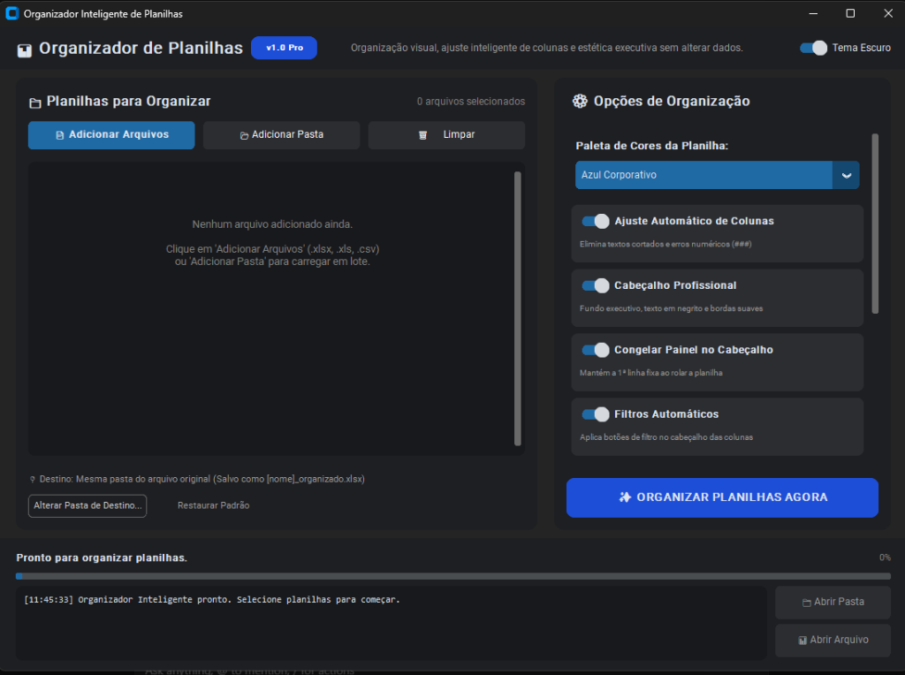

# 📊 Organizador Inteligente de Planilhas (Desktop App)

[](https://www.python.org/)
[](https://customtkinter.tomschimansky.com/)
[](https://openpyxl.readthedocs.io/)
[](LICENSE)

Um aplicativo desktop moderno e intuitivo para Windows que transforma planilhas desorganizadas, cortadas e de difícil leitura em relatórios elegantes, formatados e prontos para apresentação — **sem alterar os arquivos originais nem modificar dados/valores**.

---

## 📸 Interface do Aplicativo



---

## 🎯 Problema que o Projeto Resolve

Muitas vezes recebemos exportações de ERPs, bancos de dados ou relatórios em CSV/Excel com:
- Nomes longos e textos cortados devido a colunas muito estreitas.
- Números exibindo `###` por falta de espaço na célula.
- Falta de padrão visual em datas, moedas e números decimais.
- Cabeçalhos sem destaque que desaparecem ao rolar a página para baixo.
- Falta de filtros automáticos para análise rápida.

O **Organizador Inteligente de Planilhas** automatiza todo esse trabalho manual em segundos com apenas um clique.

---

## ✨ Funcionalidades Principais

- 📐 **Ajuste Inteligente de Colunas:** Calcula automaticamente a largura necessária de cada coluna com base no conteúdo para que nenhum dado fique cortado.
- 🎨 **Temas Corporativos:** Escolha entre estilos visuais elegantes (*Azul Corporativo*, *Esmeralda Executivo*, *Grafite Moderno*, etc.).
- 🔒 **Congelamento de Cabeçalho:** Mantém a primeira linha fixa na tela durante a rolagem de grandes volumes de linhas.
- 🔍 **Filtros Automáticos:** Aplica filtros em todas as colunas do cabeçalho automaticamente.
- 🦓 **Linhas Zebradas:** Alternância suave de cores nas linhas para melhorar a ergonomia visual na leitura.
- 💲 **Formatação Não-Destrutiva:**
  - Moedas padronizadas (`R$ #.##0,00`).
  - Datas formatadas (`DD/MM/AAAA`).
  - Alinhamento ergonômico (textos à esquerda, números à direita, datas centralizadas).
- 📑 **Suporte a Multi-Abas:** Processa e preserva todas as abas existentes na pasta de trabalho.
- 🛡️ **Segurança Total (Modo Não-Destrutivo):** O arquivo original nunca é sobrescrito; um novo arquivo `[nome]_organizado.xlsx` é gerado.

---

## 🛠️ Tecnologias Utilizadas

- **Linguagem:** Python 3.10+
- **Interface Gráfica (GUI):** `CustomTkinter` (suporte a tema escuro/claro nativo)
- **Manipulação de Planilhas:** `OpenPyXL` & `Pandas`
- **Ambiente & Testes:** Testes automatizados com verificação de integridade estrutural

---

## 🚀 Como Executar Localmente

### Pré-requisitos
- [Python 3.10+](https://www.python.org/downloads/) instalado com a opção **"Add Python to PATH"** marcada.

### 1. Clonar o repositório
```bash
git clone https://github.com/SEU_USUARIO/organizador-planilhas.git
cd organizador-planilhas
```

### 2. Instalar as dependências
```bash
pip install -r requirements.txt
```

### 3. Iniciar o aplicativo
Você pode simplesmente dar dois cliques no arquivo **`iniciar.bat`** ou executar pelo terminal:
```bash
python main.py
```

---

## 🧪 Executando os Testes Automatizados

Para rodar a suíte de testes de integridade e formatação:
```bash
python test_engine.py
```

---

## 📄 Licença

Este projeto está sob a licença [MIT](LICENSE).
